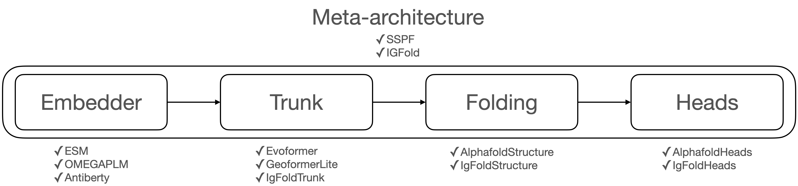

# Solvent

Solvent is a library that provides protein folding algorithms. It supports single sequence based protein folding including ESMFold, OmegaFold, and IgFold. Researchers can train and evaluate each model with same conditions and design new model variant by combining modules.
<div align="center">
<figure>
  
</figure>
</div>

## Installation
See [installation instructions](INSTALL.md)

## Data preparation
See [data preparation](datasets/README.md)

## Download pretrained language models
See [download pretrained PLMs](pretrained_model/README.md)

## Use cases
**Training ESMFold on single GPU**
```
# initial training
python train_net.py \
    --config-file configs/esm35_evo1_initial_pdbonly.yaml \
    --num-gpus 1 SOLVER.SEQ_PER_BATCH 2 \
    OUTPUT_DIR output/esm35_evo1/initial_pdbonly

# finetuning from initially trained model
python train_net.py \
    --config-file configs/esm35_evo1_finetune_pdbonly.yaml \
    --num-gpus 1 SOLVER.SEQ_PER_BATCH 2 \
    OUTPUT_DIR output/esm35_evo1/finetune_pdbonly \
    MODEL.WEIGHTS output/esm35_evo1/initial_pdbonly/model_final.pth
```

**Training models using DDP**
```
# e.g. 16 batch with 2 machines(8GPU)
# (machine 0)
python train_net.py \
    --config-file configs/esm35_evo1_initial_pdbonly.yaml \
    --num-gpus 8 --num-machines 2 --machine-rank 0 --dist-url <URL> \
    SOLVER.SEQ_PER_BATCH 16 \
    OUTPUT_DIR output/esm35_evo1/initial_pdbonly

# (machine 1)
python train_net.py \
    --config-file configs/esm35_evo1_initial_pdbonly.yaml \
    --num-gpus 8 --num-machines 2 --machine-rank 1 --dist-url <URL> \
    SOLVER.SEQ_PER_BATCH 16 \
    OUTPUT_DIR output/esm35_evo1/initial_pdbonly

```

**Evaluation on trained model**
```
python train_net.py \
    --eval-only \
    --config-file output/esm35_evo1/finetune_pdbonly/config.yaml \
    --num-gpus 1 \
    MODEL.WEIGHTS output/esm35_evo1/finetune_pdbonly/model_final.pth

```

**Inference from fasta**
```
python demo/demo.py \
    --config-file output/esm35_evo1/finetune_pdbonly/config.yaml \
    --input datasets/cameo/fasta_dir/* \
    --output output/esm35_evo1/finetune_pdbonly/results \
    --opt \
    SOLVER.SEQ_PER_BATCH 1 \
    MODEL.WEIGHTS output/esm35_evo1/finetune_pdbonly/model_final.pth
```


## References
**This repository is heavily depend on the project listed below.**

To make Solvent working as framework, we refer the pipeline of [Detectron2](https://github.com/facebookresearch/detectron2). We represent individual method using the implementation of [AlphaFold2](https://github.com/deepmind/alphafold), [OpenFold](https://github.com/aqlaboratory/openfold), [IgFold](https://github.com/Graylab/IgFold), and [OmegaFold](https://github.com/HeliXonProtein/OmegaFold).

## Citation
The description of Solvent is in the technical report below. 
```bibtex
@misc{lee2023solvent,
      title={Solvent: A Framework for Protein Folding}, 
      author={Jaemyung Lee and Jaehoon Kim and Hasun Yu and Youhan Lee},
      year={2023},
      eprint={2307.04603},
      archivePrefix={arXiv},
      primaryClass={q-bio.BM}
}
```